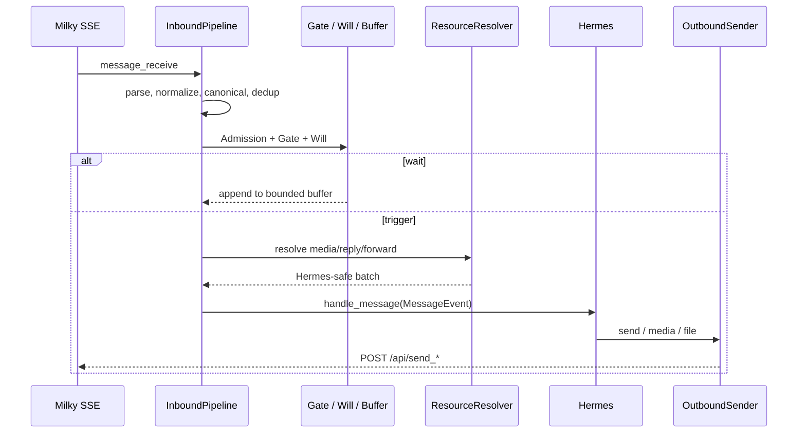

# hermes-plugin-milky 架构说明

> 本文面向第一次接触仓库的开发者和 AI agent。先读“快速判断”和“运行时主流程”，再按变更目标跳到对应模块。

## 快速判断

`hermes-plugin-milky` 是运行在 Hermes Gateway 进程内的 Milky QQ directory/platform plugin。它通过 Milky v1.3 的 HTTP Action 和 SSE 事件流接收、处理和发送 QQ 私聊与群聊消息。

它不是独立 QQ 服务、Web 服务或 Agent runtime。Hermes 拥有 Agent turn、session/transcript、入站资源 helper 和最终消息交接；本插件拥有 Milky 协议适配、入站策略、出站格式化、有限的进程内状态，以及独立的贴纸库。

唯一公开入口是 `__init__.py::register(ctx)`。导入和注册阶段不得联网、启动 SSE 或创建长期任务。普通消息只有在登录、群列表和 Bot 群成员禁言状态同步完成后，才会进入入站流水线。

本文只描述当前源码、测试、manifest、README 和已实现主规范能证明的事实。未归档的 `openspec/changes/` 是规划或进行中的工作，不能当作当前能力。无法确认的内容写成 `Not evident from the repository`，不根据惯例猜测。

## 1. 项目结构

### 1.1 目录地图

```text
hermes-plugin-milky/
├── plugin.yaml              # Hermes manifest、依赖、环境变量、25 个 Action ToolSpec 和 1 个语义 Tool
├── __init__.py              # 唯一入口：注册 platform、command、tools、skills
├── adapter.py               # MilkyAdapter；连接、停止和 Hermes 边界
├── config/                  # 启动配置、白名单和 Will policy
├── milky/                   # DTO、解析、HTTP Action、SSE、资源、日志
├── inbound/                 # canonical、pipeline、消息映射、系统事件
├── gates/                   # 固定顺序的硬门禁
├── will/                    # routing / willingness 决策引擎
├── session/                 # chat identity、Admission、dedup、buffer、上下文
├── state/                   # MuteTracker
├── outbound/                # sender、CQ、媒体、上传、拆分和 ToolSpec handler
├── stickers/                # SQLite 贴纸库、维护命令和贴纸语义工具
├── slash_commands.py        # `/milky` 命令服务
├── skills/、scripts/        # bundled skill；smoke、prompt、face catalog 工具
├── tests/、openspec/        # 测试 fixture；当前 spec、change、归档历史和 evidence
├── pyproject.toml、uv.lock  # uv、Setuptools、Ruff、pytest、构建和锁定依赖
├── README.md                # 安装、配置、能力和安全警告
└── AGENTS.md                # 仓库开发约束和事实来源规则
```

没有 frontend、独立 backend、ORM、消息队列、容器编排或 Infrastructure-as-Code。`dist/`
和 `hermes_plugin_milky.egg-info/` 是已有构建/开发产物，不是额外运行入口。

### 1.2 改动导航

| 目标 | 先看哪里 | 主要影响 |
|---|---|---|
| 配置和默认值 | `config/__init__.py`、`plugin.yaml` | 启动校验、manifest、adapter 组装 |
| 协议字段和 segment | `milky/models.py`、`parser.py`、`inbound/normalizer.py` | canonical、资源、context、fixture |
| 普通消息触发 | `inbound/pipeline.py`、`gates/`、`will/`、`session/` | dedup、Gate、buffer、Agent handoff |
| 系统事件 | `inbound/system_events.py`、`session/context.py` | context FIFO、即时成员通知 |
| 媒体和文件发送 | `outbound/sender.py`、`materialization.py`、`file_upload.py` | 本地文件边界、Milky Action |
| QQ Agent 工具 | `outbound/tools.py`、`plugin.yaml`、`milky/client.py` | schema、allowlist、权限风险 |
| 贴纸功能 | `stickers/`、`slash_commands.py` | SQLite、文件库、只读搜索和单次发送 |
| 连接和停止 | `adapter.py`、`milky/event_stream.py`、`state/mute_tracker.py` | 同步、SSE、任务释放 |

## 2. 系统图

```text
QQ 用户/事件 <-> Milky 服务
                  │ SSE / HTTP Action
                  v
MilkyAdapter -> InboundPipeline -> Hermes Gateway -> Agent session/turn -> OutboundSender -> Milky
                                      ├── 固定 ToolSpec -> sender/client
                                      └── /milky -> SlashCommandService -> stickers.db / 文件库
```

关键边界：

- Hermes 是宿主边界，提供 platform registry、Agent session、消息队列和资源 helper。
- Milky 是外部 QQ 协议边界；插件只通过 HTTP Action 和 SSE 与它通信。
- SSE 不直接创建 Agent turn；普通消息必须经过 `InboundPipeline`。
- ToolSpec 先经过固定 schema/handler，再调用受限的 client/sender；没有通用 Action catalog。
- 贴纸数据库和文件目录只由显式贴纸维护、`sticker_search` 或 `sticker_send` 使用。

## 3. 核心组件

### 3.1 注册入口和生命周期

`register(ctx)` 一次性解析 `MilkyConfig`，注册 bundled skills、`/milky`、25 个 Milky Action ToolSpec、`sticker_search`、`sticker_send`，以及 Milky platform 和可选的 home-channel cron 元数据。

它还注册两个无网络的 `after_memory` prompt section：平台使用指导，以及当前 QQ 会话资料快照。注册阶段只组装 service/factory，不创建 HTTP client 请求、SSE、长期 task 或贴纸数据库访问。

`adapter.py::MilkyAdapter` 通过构造参数拥有 `MilkyClient`、`SseEventStream`、`MuteTracker`、`ResourceResolver`、`InboundPipeline`、`MilkyOutboundSender`、`WaitBuffer`、`ChatAdmissionCoordinator`、`TtlDeduplicator`、Will engine 和 session snapshot store。依赖可注入，因此 fake host/transport 可以覆盖生命周期而不连接真实 Milky。

连接顺序固定为：

```text
get_login_info
  -> get_group_list
  -> 按入站白名单筛选群
  -> 查询选中群的 Bot member 状态（no_cache=true）
  -> 提交 MuteTracker 初始快照
  -> 恢复 Hermes 已确认的 session key
  -> 创建并启动 InboundPipeline
  -> 绑定 command/sender
  -> 启动 GET /event SSE
  -> adapter ready，开放 message_receive
```

初始同步失败时保持 fail closed，不把普通消息交给 pipeline，并向 Hermes 报告分类错误。`disconnect()` 幂等：先停止 SSE，再取消并等待 handler/pipeline task，关闭 sender、MuteTracker、command service 和 HTTP client。清理某个组件失败不能阻止其他组件释放。

SSE 重连不会假设服务端补发断线期间的消息，也不会恢复 wait buffer、system context 或 Will 分数。

### 3.2 Milky 协议层

协议层按职责分为：`models.py` 的 typed DTO；`parser.py` 的事件/response 解析；`client.py` 的
Bearer、HTTP、envelope、字段校验和错误分类；`event_stream.py` 的 SSE 分帧、handler、重连和取消；
`resources.py` 的资源补全；`face_catalog.py` 的本地 face 映射；`logging.py` 的安全日志。
它们不编排 Agent、不执行任意 Action，也不复制 Hermes 的下载缓存。

请求地址和认证形式：

```text
POST <MILKY_BASE_URL>/api/{action}
GET  <MILKY_BASE_URL>/event
Authorization: Bearer <MILKY_ACCESS_TOKEN>
```

登录、群列表、成员状态同步、消息发送和文件上传等非 Tool Action 仍需校验 JSON、`status`、`retcode`
和所需 `data`，并区分 `invalid_input`、`unsupported`、`rejected`、`malformed`、`http_error` 和
`transport_unknown`。已注册 Tool 走独立的响应边界：网络前校验固定参数和 client 状态，取得响应体后
按 UTF-8（无法解码的字节使用替换字符）直接交付字符串，不判断 HTTP/协议状态、不解析 envelope、
不校验 `data`、不脱敏或重建结果；只有参数非法、Tool 不支持或没有取得响应体时才产生插件固定分类。
可能有副作用的 Action 最多提交一次；超时或连接中断时不自动重试，因为远端结果可能未知。

SSE 支持 `event:`、多行 `data:`、空行分帧、UTF-8、未知事件、handler 异常、EOF 和连接错误。
receive loop 不等待慢 handler；handler 在停止时统一取消并等待，重连退避有界。

### 3.3 入站策略和状态

普通消息的编排集中在 `inbound/pipeline.py::InboundPipeline`：

1. 只有 `message_receive` 进入普通消息路径；其他事件交给 system-event observer。
2. parser、normalizer、extractor 生成 typed 的 `CanonicalMessage`。
3. 在资源补全和 Hermes turn 之前执行稳定 TTL dedup。
4. 进入 per-chat Admission，再按顺序执行 Self、allowlist、mute 等 Gate。
5. `/milky` 走命令分支；其他消息进入 routing 或 willingness Will engine。
6. `wait` 写入有界 FIFO；`trigger` 原子 drain 当前 chat，并扣一次 `replyCost`。
7. 只有 trigger 才补全资源、生成 Hermes `MessageEvent` 并调用 `handle_message()`。

chat key 只接受 `dm:<十进制 QQ 号>` 和 `group:<十进制群号>`。`temp` 或非法目标不创建 key、dedup、buffer、Will 或 turn。Admission 只保证插件 ingress 顺序，不复制 Hermes 的 busy、follow-up、interrupt 或 Agent queue；不同 chat 可以并行。

`will/routing.py` 根据 direct、mention、mentionAll、quote、poke、allMessage 和关键词选择 `wait`/`trigger`。`will/willingness.py` 使用分数衰减、增益、阈值和 force 规则。两种 engine 互斥，均不授予工具权限。

### 3.4 系统事件、会话快照和禁言

`inbound/system_events.py` 处理 recall、nudge、群成员加入/退出等事件。默认行为是写入每 chat 有界的 context-only FIFO，不创建普通 turn、不扣 Will cost、不自动调用 Action；它与 wait 消息共享 ingress sequence，在下一次 trigger 中按序合并。

开启 `MILKY_GROUP_MEMBER_EVENT_NOTIFICATIONS=true` 后，成员加入/退出事件可使用已确认或恢复的 Hermes session key 调用 `inject_message()`。没有确认的 key 时只保留 context，绝不能从 `group:<id>` 猜出 session key。

`session/identity.py` 是 chat key 和 Bot identity 的单一校验点。`session/admission.py` 管理短临界区和 sequence；`session/dedup.py` 默认使用 300 秒、最多 10,000 条的进程内 TTL map；`session/buffer.py` 默认每 chat 保存 20 条 wait 历史；`session/qq_context.py` 默认最多保存 256 个会话资料快照。它们都不跨进程持久化。

`state/mute_tracker.py` 是 Bot 群禁言状态的唯一拥有者。冷启动和运行期刷新分别维护个人禁言、全体禁言和 `unknown`；状态未知时 Gate 保守拒绝群消息。运行期刷新带 per-group lock、冷却、并发上限和可取消的 TTL task。

### 3.5 出站、文件和工具

`outbound/sender.py` 同时服务 live adapter、ToolSpec 和 standalone sender：

- `dm:<id>` 只路由到 `send_private_message`；`group:<id>` 只路由到 `send_group_message`。
- 目标在网络请求前校验；非法或 `temp` 目标不回退到其他目标。
- `formatter.py` 处理 CQ-compatible text、mention、reply 和 face；`chunking.py` 处理长度分块。
- `splitting.py` 识别 `[SPLIT]`，最多产生 3 条有序消息；`[SILENT]` 由 Hermes core 处理。普通文本出站会在 sender 前精确过滤 Hermes 的 silence-marker 兜底文案；命中时返回成功但不生成远端 message ID，Gateway 仍可能按既有 `success` 语义将 obligation 记为 delivered。
- `materialization.py` 和 `file_upload.py` 只读一次出站本地资源，并受启动时大小上限约束。
- 图片、语音、视频和 document 可走 native media/file upload；插件不把本地路径直接交给 Milky。
- `MILKY_LONG_TEXT_FORWARD_THRESHOLD` 大于 0 时，超长文本可与有序 native media 合成一个 forward。
- 25 个 Milky Action ToolSpec 在取得响应体后原样交付字符串；Tool 不执行 envelope/DTO 解析、最小
  `data` 校验、敏感键过滤、容器冻结、状态码包装或结果重建。非 Tool Action 保持既有校验与错误分类。

Tool 字符串交给 Hermes core 后，core 可能运行 `transform_tool_result`、截断 JSON `error` 字段，
或将超长结果落盘并以预览替换上下文内容。这些后置处理由宿主所有，不在插件契约内；插件不注册、
规避或还原它们。

manifest 中固定提供以下 25 个 Milky Action ToolSpec：

```text
send_profile_like, send_friend_nudge, send_group_nudge, recall_group_message, get_group_info, get_group_member_list, get_group_member_info,
set_group_member_mute, set_group_whole_mute, get_forwarded_messages, get_private_file_download_url, kick_group_member, quit_group, delete_friend,
get_friend_requests, accept_friend_request, reject_friend_request, get_group_file_download_url, accept_group_request, reject_group_request,
accept_group_invitation, reject_group_invitation, get_group_files, get_friend_info, set_group_member_special_title
```

另有语义工具 `sticker_search` 和 `sticker_send`。工具 schema 禁止未知字段并校验 QQ ID、消息序号、枚举和值域；插件不根据正文、关键词、Will 或事件隐式触发状态变更。搜索只返回有界元数据，发送支持查询或持久化 opaque ID。

### 3.6 贴纸子系统

`/milky sticker` 提供 `add`、`list`、`edit`、`reanalyze`、`del`、`cleanup`、`reindex`。维护服务批量上限为 50，视觉分析并发上限为 10，图片输入、路径、格式、大小和 SHA-256 均校验。

贴纸库只在显式命令、`sticker_search` 或 `sticker_send` 首次需要时懒加载。数据库和文件目录不参与普通消息、SSE 或 Will。`StickerStore` 使用 plugin-data 下的 `stickers.db`，并维护 `sticker_items`、`sticker_files`、`sticker_send_usage`；图片位于受控的 inbox/library/junk 目录。

`sticker_search` 以只读方式校验现有库、复用查询匹配并返回有界候选，不改变使用统计或轮换状态。`sticker_send` 在一次 Tool 调用中完成查询或 ID 选择、使用次数 claim、文件校验和一次发送；ID 选择跳过匹配和轮换，但仍重新校验条目和文件。
贴纸 SQLite 与文件移动不是单一事务，崩溃后需要 `cleanup` 或 `reindex` 修复孤儿状态。

## 4. 主要数据流

### 4.1 普通消息



资源解析在 trigger 之后，减少被 Gate、dedup 或 wait 丢弃消息的网络和缓存成本。资源缺失、远端未知结果和映射失败不会被包装成成功。

系统事件先进入 `system_events` observer，再写入 context FIFO；下一次同 chat trigger 时按 sequence 合并。只有成员事件开关开启且 session key 已确认，才可 `inject_message`。

普通文本出站先精确检查已登记的完整拦截文案；命中时终止处理，不调用 Milky Action，也不返回远端 message ID。其余 `Hermes response / MEDIA:/local/path` 继续 split/format/校验目标 → 一次 materialize 或 upload → 一次 Action → `success`、`rejected` 或 `transport_unknown`。过滤结果可能被 Gateway 按 `SendResult.success` 记为 delivered。
Tool 流程是固定 schema/handler → 参数和 client 状态校验 → 一次 Action → 已取得的响应字符串，或
`invalid_input`、`unsupported`、`transport_unknown`；Tool 不把远端拒绝或 HTTP 错误改写为插件结果。

`transport_unknown` 表示请求失败但无法确认远端是否已执行。插件不为了“修复”未知结果而自动重试可能有副作用的 Action。

## 5. 数据存储和所有权

| 存储 | 类型 | 所有者 | 生命周期 |
|---|---|---|---|
| Hermes session/transcript | 宿主存储 | Hermes | 由 Hermes 管理，本插件只使用确认的 session key |
| Hermes 入站媒体缓存 | 宿主 helper | Hermes | `milky/resources.py` 委托，不在插件复制 |
| Milky 事件、dedup、buffer、Will、mute、snapshot | 进程内内存 | 本插件 | 重启、跨实例不恢复 |
| `stickers.db` | SQLite | `stickers/` | plugin-data 下持久化，命令结束关闭连接 |
| sticker image library | 本地文件 | `stickers/` | 受控目录、校验后保留 |

仓库没有其他数据库、ORM、消息队列、迁移服务或远程缓存的证据。SQLite schema 在 `stickers/storage.py` 中创建和迁移；备份、保留策略和跨进程锁定方案为 `Not evident from the repository`。

## 6. 外部集成和 API

### Hermes Gateway

集成点是 `register_platform`、`BasePlatformAdapter`、`handle_message`、`inject_message`、系统 prompt section、plugin-data 目录和媒体 helper。Hermes 负责 Agent、session、队列、媒体下载/缓存和最终发送交接；插件不 monkey patch Hermes core。

### Milky v1.3

集成方式是 Bearer-authenticated HTTP Action 加 SSE `GET /event`。Action 既有查询，也有发送、禁言、踢人、好友和请求处理等副作用。非 Tool 请求的参数、response envelope、`status`/`retcode`、typed data 和错误分类在 `milky/client.py` 中校验；Tool 只在网络前校验参数，并把取得的 body 交给 Hermes core。

**其他服务。** 仓库没有 WebSocket、Webhook、OneBot echo、独立视觉服务、STT 服务、云数据库或队列客户端的独立连接配置。贴纸视觉分析若由 Hermes plugin context 提供，其具体 provider、凭证和部署位置是 `Not evident from the repository`。

## 7. 配置、技术栈和构建

### 7.1 技术栈

- Python 3.13+；asyncio 是连接、SSE、资源、刷新和 per-chat 协调的并发模型。
- `httpx` 承担 Milky HTTP/SSE transport；Pillow 校验贴纸图片；jieba 负责贴纸检索分词。
- SQLite 使用 Python 标准库；Setuptools 构建 wheel/sdist；Hermes 通过 `plugin.yaml` 加载。
- pytest、Ruff 和 uv 服务于本地测试、质量检查、格式化、锁定和构建。

### 7.2 配置入口

必需环境变量：`MILKY_BASE_URL`、`MILKY_ACCESS_TOKEN`。

可选环境变量：

| 变量 | 默认值 | 作用 |
|---|---:|---|
| `MILKY_ALLOWED_CHATS` | 空 | 入站白名单；支持具体 `dm:`/`group:` 和对应 `*` |
| `MILKY_WILL_POLICY` | routing 默认策略 | `routing` 或 `willingness` 的 wait/trigger 规则 |
| `MILKY_SESSION_BUFFER_SIZE` | `20` | 每 chat wait 历史上限；`0` 关闭 |
| `MILKY_HOME_CHANNEL` | 未配置 | 系统/cron 默认目标，不参与入站白名单 |
| `MILKY_MAX_LOCAL_MEDIA_BYTES` | `33554432` | 出站本地资源上限；合法范围 8–32 MiB |
| `MILKY_LONG_TEXT_FORWARD_THRESHOLD` | `0` | 超长 forward 阈值；0 表示关闭 |
| `MILKY_GROUP_MEMBER_EVENT_NOTIFICATIONS` | `false` | 是否注入成员加入/退出事件 |

`config/__init__.py` 在启动时一次解析配置，校验 URL、chat key、Action 名称、整数、JSON、布尔值和范围；错误不得回显 token。配置变更需要重启 Gateway 才会生效。

### 7.3 构建和部署边界

本地环境只使用 `uv`；安装插件后由 Hermes Gateway 加载目录中的 manifest 和入口。仓库没有 Dockerfile、Kubernetes、Terraform、Ansible、systemd、GitHub Actions、云托管或自动发布配置。生产 hosting、进程监管、备份、滚动升级、回滚和多实例路由均为 `Not evident from the repository`。

## 8. 安全架构

### 8.1 已实现的边界

- Milky 使用 Bearer token；`MILKY_BASE_URL` 只接受绝对 HTTP(S)，不接受 URL 内用户名/密码、
  query 或 fragment；Action 名称只接受 ASCII 字母、数字和下划线。
- chat key 严格限制为 `dm:<数字>` 或 `group:<数字>`；temp、非法目标和不匹配目标 fail closed。
- allowlist 在入站 Gate 生效；被 Gate 拒绝的消息不增长 buffer、不修改 Will、不创建 turn。
- ToolSpec `additionalProperties=false`，参数有明确类型、枚举、ID 和消息序号范围。
- sticker 路径限制在 plugin-data library，拒绝路径穿越和不受控文件，并校验 regular file、格式、大小、SHA-256；出站本地资源只读取一次并受大小上限约束。
- 协议 parser、入站规范化和 canonical 保留远端 raw 字段和值，不因通用敏感键名删除业务字段；raw
  不进入正文、关键词、会话介绍或隐式工具调用。
- 日志、diagnostics 和 smoke 摘要不输出 token、Authorization、完整 body、正文、媒体 URL、本地路径、图片 bytes 或异常正文。Tool 结果本身不在插件侧脱敏，`access_token`、`authorization`、`cookie`、`password`、`token` 等字段可能随原始响应进入宿主上下文；上下文策略由 Hermes core 负责。

### 8.2 当前风险和未知项

`MILKY_ALLOWED_CHATS` 只约束入站会话，不等于 ToolSpec、slash command 或出站 sender 的调用者授权。当前 25 个 Action tool 没有插件内独立的操作者/目标授权层；其中包含禁言、踢人、撤回、退群、删好友和请求处理。部署时必须把 Hermes tool 权限和 Milky 目标限制视为外部责任。

插件不强制 HTTPS，也没有证据表明实现 OAuth、token rotation、独立 session cookie、静态加密、SQLite 文件权限治理、CORS/CSP 或专用 secrets backend。这些均为 `Not evident from the repository`。

## 9. 可观测性、性能和扩展性

**可观测性。** logger 命名空间为 `hermes_plugins.milky.*`，主要事件包括 lifecycle、action、sse、inbound、resource、outbound、mute 和 tool。日志使用固定分类、计数、耗时、HTTP status（可确认时）和安全序号；adapter、SSE、pipeline 有界 diagnostics，`scripts/milky_smoke.py` 提供固定元数据摘要。协议 raw 保真不等于日志脱敏：插件不创建独立日志脱敏器，也不把 raw、响应或异常正文复制到日志。Tool 结果、模型上下文和 session 持久化由 Hermes core 的对应出口决定，插件不声称这些出口会统一清洗秘密；真实宿主行为仍待集成验证。

仓库没有 metrics、distributed tracing、error-reporting SDK、health endpoint、audit log、dashboard 或 alerting 配置证据。

**性能模型。**

- 同一 chat 的策略临界区按 ingress sequence 串行；不同 chat 可并行。
- SSE receive loop 不等待业务 handler，handler 和资源任务在停止时可取消。
- dedup、wait buffer、context、session snapshot 和 diagnostics 都有容量上限。
- MuteTracker 的稳态刷新有 per-group lock、冷却和并发上限。
- 文本可分块；大本地媒体经过一次读取和 base64，成本受 8–32 MiB 启动限制影响。

插件状态在进程内，未实现跨实例 dedup、buffer/Will 恢复、sticky routing 或故障转移一致性。透明水平扩展和生产容量上限为 `Not evident from the repository`；已知成本包括 base64 放大、Milky Action 延迟和 Hermes Agent 处理能力。

## 10. 开发和测试

### 10.1 本地工作流

要求 Python 3.13+ 和 uv；不得使用 pip、pipx 或直接调用 python/python3：

```text
uv sync
uv run pytest -q
uv run ruff check .
uv run ruff format --check .
uv build
git diff --check
openspec validate --changes --strict
```

真实 Milky smoke：

```text
uv run scripts/milky_smoke.py --help
```

smoke 默认只读；发送或上传必须显式 `--allow-write`，目标还必须命中运行时 `MILKY_ALLOWED_CHATS`。fake transport 或 fixture 通过不等于真实 Hermes/Milky 集成通过。

### 10.2 测试架构

测试位于 `tests/`，主要使用 fake Hermes host、fake HTTP/SSE transport、合成 JSON fixture、合成媒体、可注入时钟和随机源。覆盖边界包括：

| 范围 | 代表测试 |
|---|---|
| 生命周期、配置和策略 | `test_plugin_entry.py`、`test_adapter_lifecycle.py`、`test_home_channel.py`、`test_config.py`、`test_gate_registry.py`、`test_will_*.py`、`test_admission.py` |
| parser、normalizer、canonical、系统事件 | `test_milky_parser.py`、`test_normalizer.py`、`test_canonical.py`、`test_protocol_fixtures.py` |
| client、SSE、未知结果、资源 | `test_milky_client.py`、`test_milky_event_stream.py`、`test_unknown_send_outcomes.py`、`test_resources.py` |
| CQ、媒体、分块、sender、tools、mute | `test_cq_formatter.py`、`test_multimedia_outbound.py`、`test_outbound.py`、`test_qq_tools.py` |
| prompt、model、slash、贴纸、HTTPX | `test_hermes_prompt_integration.py`、`test_model_control_integration.py`、`test_slash_commands.py`、`test_sticker_*.py`、`test_milky_local_integration.py` |

测试证明本地模块契约、错误分类、日志/输出最小化和生命周期清理；不证明真实 QQ 权限、Milky 字段版本、真实媒体发送、视觉 provider、Hermes 宿主日志/Tool 后处理/会话落盘、生产 CI 或部署行为。覆盖率阈值和 CI 执行环境是 `Not evident from the repository`。

## 11. 架构决策、风险和未来工作

### 已观察到的决策

- **作为 Hermes plugin，而非独立服务。** 复用宿主 session、Agent、队列和媒体 helper；代价是强依赖 Hermes 扩展点。
- **HTTP Action 与 SSE 分离。** 长连接重连/取消和副作用请求有不同生命周期；不维护 echo/pending response map。
- **先 canonical/dedup/Gate/Will，再补资源和 handoff。** 先过滤重复、越权和不需要回复的消息，节省资源成本。
- **固定 ToolSpec，不开放任意 Action。** 能力可发现、可审计、可测试；新增 Action 必须同步 manifest、schema、handler 和测试。
- **贴纸库独立且懒加载。** 避免污染 Hermes session DB，也避免普通消息产生文件和视觉分析副作用。
- **未知结果显式保守处理。** 不在远端执行状态不明时自动重试或声称成功；代价是可能需要人工核对。

### 当前风险和技术债

- ToolSpec 缺少独立调用者/目标授权，是最高影响的权限缺口。
- 进程内 dedup、buffer、Will、mute 和 snapshot 在重启/多实例中不连续。
- 远端副作用可能进入 `transport_unknown`，本地不能自动判断是否已完成。
- SQLite 与文件库不是单一事务，崩溃后需要 cleanup/reindex。
- 模块级活动 sender binding 和多 adapter 隔离能力需要继续审查；更强保证为 `Not evident from the repository`。
- 真实 Hermes、Milky、QQ 权限和第三方 provider 的集成证据仍有限。

### 未交付规划与建议

未归档 change 中的 idle-session wakeup、relationship system、自动 QQ sticker library 不是当前能力。在实现前应分别定义 session 注入授权、关系状态所有权、贴纸入站 hook 和持久化迁移边界。

基于当前结构的建议：先补 ToolSpec 授权，再考虑多实例；随后补 health/metrics/trace、SQLite 备份和恢复；同时把活动 sender 改为 adapter/session 级依赖注入，减少跨实例共享风险。

## 12. 项目识别与术语

| 项目 | 当前事实 |
|---|---|
| 名称 | `hermes-plugin-milky` |
| 类型 | Hermes directory/platform plugin |
| 语言 | Python 3.13+ |
| 协议 | Milky v1.3 HTTP Action + SSE |
| 公开入口 | `__init__.py::register(ctx)` |
| manifest/package version | manifest 2；package 1.9.0 |
| 维护者 | `ByteColtX`（manifest 和 pyproject author） |
| 架构复核日期 | 2026-09-14 |
| 部署目标 | Hermes Gateway；具体 hosting 为 `Not evident from the repository` |

| 术语 | 含义 |
|---|---|
| chat key / canonical message / Admission | chat key 是严格的 `dm:<QQ号>` 或 `group:<群号>`；canonical 是 parser、normalizer、identity 校验后的不可变记录；Admission 是保证插件 ingress 顺序的每 chat 短临界区 |
| Gate | Will 前的确定性硬门禁 |
| Will | 决定 `wait` 或 `trigger` 的 routing/willingness 策略 |
| wait buffer / trigger batch / system context | wait buffer 是每 chat 有界 FIFO；trigger batch 是原子 drain 后交给 Hermes 的批次；system context 是 recall、nudge、member 等 context-only 事件 |
| materialization | 将本地资源变成受控的发送输入；不是直接传本地路径 |
| ToolSpec / 贴纸语义工具 | ToolSpec 是固定名称、schema、handler 和检查函数组成的 Agent 工具；`sticker_search` 从本地库返回有界元数据，`sticker_send` 选择并发送一张图片 |
| `transport_unknown` | 网络失败且无法确认远端副作用是否已执行 |
| `[SPLIT]` / `[SILENT]` / standalone sender | 出站分段标记 / Hermes core 的静默控制 / 没有 live adapter 时供 cron/home channel 使用的一次性 sender |
